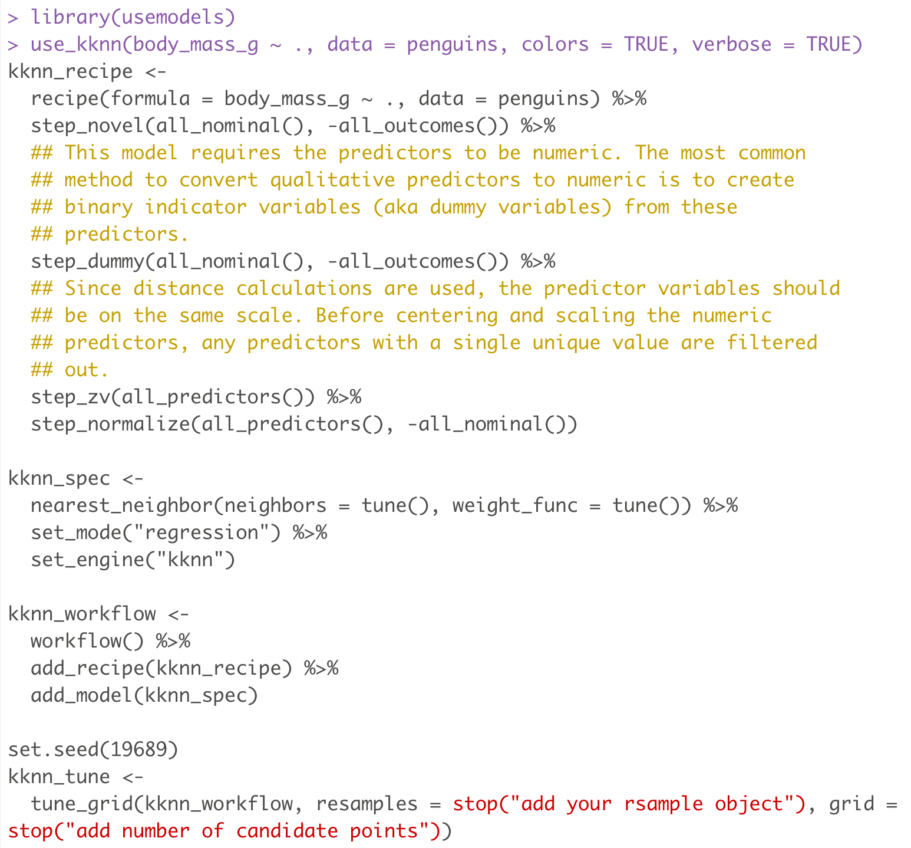
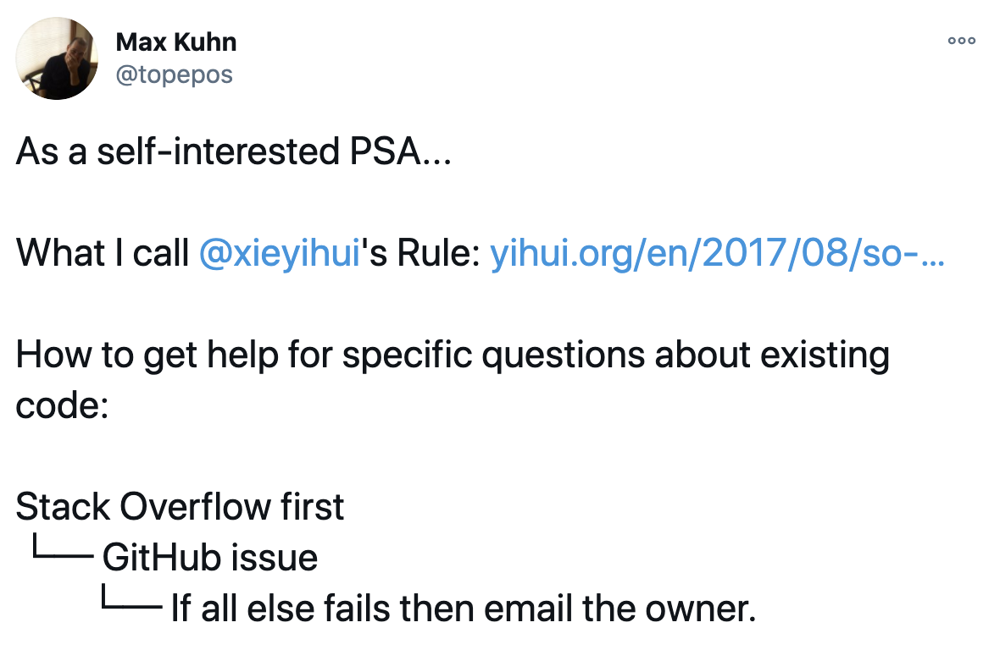

# Introduction

_Applied Predictive Modeling_ (APM) was written between 2010 and 2012. A lot has changed since then. There are new modeling methods and better implementations of some existing models. There are also some techniques that have been deprecated or are not as relevant as they once were. Needless to say, if we were writing this book today, it would be somewhat different. 

The purpose of this website is to show how a more modern R framework for modeling, called tidymodels, can be used on the same data sets. The tidymodels framework is a collection of packages for modeling and machine learning using [tidyverse](https://www.tidyverse.org/) principles. Many of these principles are outlined in Chapters 1 and 2 of [_Tidy Models with R_](https://www.tmwr.org) (TMwR). 

:::rmdrefs
TMwR is used a lot on this website. It would a good place to start, especially if you are unfamiliar with the tidyverse
:::

tidymodels is not `r pkg(caret)`. It is more modular and not intended to contain every possible modeling method in R. Luckily, it is not hard to add modeling methods to the system. There are already user-generated packages that fill in unmet needs that the canonical tidymodels packages not facilitate (e.g, `r pkg(modeltime)` and others). also, tidymodels can do a lot more than `r pkg(caret)`. For example, there are far more preprocessing and feature engineering options in the new system. These pre-modeling techniques can also be tuned along with the model parameters. tidymodels has additional tuning methods and other features.  

As a result, this companion is not a 1:1 translation of `r pkg(caret)` code to tidymodels. There is a suite of models that `r pkg(caret)` supports but tidymodels does not. For example, the `r pkg(RWeka)` packages are not part of the canonical tidymodels system, because of their use of `r pkg(rJava)` (which can be problematic to support on some operating systems).  

There are not any real analyses in this chapter of _APM_ so there is no code to reproduce. Instead, start with a comparison between `r pkg(caret)` and tidymodels then discuss some practical issues for using this website. Since you are reading a tidymodels companion to a book that focuses on `r pkg(caret)`, we'll assume you know `r pkg(caret)` fairly well. 

## A high level tour of tidymodels packages

`r pkg(caret)` contains a lot of disparate tools for model fitting, tuning, resampling, performance assessment, feature selection, and other tasks. The philosophy of the tidyverse is to create smaller, more modular packages that work together. There are substantially benefits to structuring the system this way: ease of support and testing, avoiding scope creep, and so on. The downside is that users can sometimes find it confusion. Some of the packages are not necessarily named in a way that makes their purposes clear (although the names are usually memorable).  


The remedy to this is to use the `r pkg(tidymodels)` package. This automatically loads the core group of tidymodels packages and has tools to install and load the non-core packages too. The nice thing about this is that users can memorize _functions_ that are useful instead of the packages that contain the functions that they need. Loading the package gives a nice summary of the core packages: 

```{r chapter-01-tm}
library(tidymodels)
```

Note that there are commonly used tidyverse packages in this list too. This package has a _tagging_ system that has lists of tidy packages that specialize in certain types of analyses. The current set of tags are: 

```{r chapter-01-tags}
tag_show()
```

See `?tag_show` for other tag-related functions. 

Now let's look at some of the the primary tidymodels packages. 

### The parsnip package

This package contains the infrastructure for defining and fitting models. One of the tidymodels philosophies is to separate the planning from the doing. For example, when you fit a model using `lm(formula, data)`, it defines the model to be fit and then fits it. There are some disadvantages to doing this and, in tidymodels, we first define models before fitting them. For example, a simple linear model _specification_ would be: 

```{r chapter-01-lm-spec}
lm_spec <- linear_reg() %>% set_engine("lm")
```

The _engine_ is related to how it should be fit. The use of `linear_reg()` defines that there is a numeric output and the structural form of the model is that there are simple linear combinations of model parameters. This would also be true for regularized models, Bayesian models, robust models, and so on. Taking this approach makes it easy to switch between estimation methods (or packages) for the same model type. 

Fitting is done using the `fit()` or `fit_xy()` function. The former takes a formula and the latter is the non-formula interface. For example: 

```{r chapter-01-lm-fit}
lm_spec %>% fit(mpg ~ ., data = mtcars)
```

Like `r pkg(caret)`, the underling `lm` object is saved in the `r pkg(parsnip)` model fit object. 

`r pkg(parsnip)` contains a number of model definitions for different types of models. Because it depends on a lot of package, there are a variety of `r pkg(parsnip)`-adjacent package that also contain model definitions for specific types of models. For example `r pkg(rules)` is for rule-based models, `r pkg(discrim)` focuses on discriminant analysis techniques and so on. 

A full list of the models in `r pkg(parsnip)` and its ancillary packages is at [`tidymodels.org/find/parsnip/`](https://www.tidymodels.org/find/parsnip/). 


### The recipes package

tidymodels fully supports the standard R formula as well as the non-formula interface. There are some limitations imposed by these methods though. After rethinking the standard infrastructure for specifying variables and preprocessing them prior to modeling, the `r pkg(recipes)` package was born. 

A recipe is a step-by-step set of instructions for how to treat the data. There are formula and non-formula interfaces to start the recipe and these are only used to define what data columns are outcomes and which are predictors. For example, engine displacement in the `mtcars` data can be linearized using a simple transformation: 

```{r chapter-01-recipe-disp}
car_rec <- 
  recipe(mpg ~ ., data = mtcars) %>% 
  step_mutate(displ = 1/sqrt(disp))
```

This is a pretty simple recipe that defines a deterministic transformation of a predictor. The recipe does the following: defines `mpg` as the outcome and the other columns as predictors then specifies how we should encode the `disp` column. Preprocessing steps are sequentially piped into the recipe definition. A single formula could have been defined to to the same operations. However, the power of recipes comes from being able to do more serious data preprocessing. It can also encapsulate all of the predictor data data manipulations into a single object (as oppose to being manually coded across multiple R files). If you are new to recipes, the `tidymodels.org` [_Get Started_](https://www.tidymodels.org/start/) articles show a lot of what can be done. 

Like `r pkg(parsnip)`, there are supplementary packages that contain additional recipe definitions. For example, the `r pkg(embed)` package has steps for sophisticated transformations (e.g. UMAP, entity embeddings, etc) while `r pkg(textrecipes)` contains excellent tools for processing text data (see the [_Supervised Machine Learning for Text Analysis in R_](https://smltar.com/) book for examples with text). 

A list of all recipes steps across packages can be found at [`tidymodels.org/find/recipes/`](https://www.tidymodels.org/find/recipes/). 

### The workflows package

In the course of creating models, a variety of models and preprocessing steps might be evaluated before finding the best technique for the data at hand. An R script might have a lot of objects in them that have been combined. A workflow object is a way to bind specific models and preprocessors together so that projects can be better organized. As an example, [_Supervised Machine Learning for Text Analysis in R_](https://smltar.com/mlclassification.html#classfirstmodel) use the following recipe and model to build a classification model on consumer complaint data: 

```{r chapter-01-smltar-ex, eval = FALSE}
library(textrecipes)
library(discrim)

complaints_rec <- 
  recipe(product ~ consumer_complaint_narrative, data = complaints_train) %>%
  # Convert text strings to tokens
  step_tokenize(consumer_complaint_narrative) %>%
  # Remove frequently occurring words
  step_stopwords(consumer_complaint_narrative) %>%
  # Filter the tokens
  step_tokenfilter(consumer_complaint_narrative, max_tokens = 500) %>%
  # Convert tokens to features
  step_tfidf(consumer_complaint_narrative)

nb_spec <- 
  naive_Bayes() %>%
  set_engine("naivebayes")
```

A workflow can be used to bind these together: 

```{r chapter-01-wflow-bind, eval = FALSE}
complaint_wf <- 
  workflow() %>%
  add_recipe(complaints_rec) %>% 
  add_model(nb_spec)
```

Not only are the model and preprocessing actions defined in a single object, fitting the model is streamlined into a single step:

```{r chapter-01-wflow-fit, eval = FALSE}
complaint_wf %>% fit(data = complaints_train)
```

As previously mentioned, the process of finding the right model and features can involved a lot of attempts. Instead of creating a lot of objects, workflow set are methods of creating a series or collections of workflows that are processed with very few lines of code. This method, from the `r pkg(workflowsets)` package, is used on this website. 

### The rsample package

`r pkg(rsample)` contains tools for resampling. It creates data frames that contain the resampled data (where each row of the data frame is a resample). `r pkg(caret)` embeds the resamples inside of the objects produced by `train()`, `rfe()` and other `r pkg(caret)` functions. `r pkg(rsample)` contains memory efficient objects with the resamples, and tidymodels functions work on these objects. 

For example, this code created 50 resamples of the `mtcars` data that has minimal memory allocation. 

```{r chapter-01-rsample}
set.seed(1)
boots <- bootstraps(mtcars, times = 50)
boots

# The fold increase in memory for 50 resamples of the same size:

library(lobstr)
as.numeric(lobstr::obj_size(boots)/lobstr::obj_size(mtcars))

# Much smaller than 50
```

All of the information to reproduce the bootstrap sample, as well as the out-of-bag data, are contained in the `splits` column. There are simple functions to obtain these data frames. 

### The tune package

This package uses almost all of the other tidymodels packages. `r pkg(tune)` contains tools for finding good values of any model tuning parameters (e.g. via grid search or Bayesian optimization). It also has tools for simply resampling models as well as finalizing the models and obtaining test set results. This package is most analogous to  `caret::train()`. It is heavily used in this website. 

An ancillary package, `r pkg(finetune)`, has additional grid search and iterative optimization routines for model tuning. 

### A few other package

The following package are important but are used less frequently: 

* `r pkg(broom)` is one of the original tidy packages for modeling. It can create tidy data frames of numerous quantities produced by modeling objects. For example, using `tidy(lm_object)` creates a highly functional version of the `summary(lm_object)` results where the terms are not encoded as row names and the column names have standardized values. 

* `r pkg(yardstick)` has functions and tools for performance assessment statistics (e.g., accuracy, RMSE, etc). 

* `r pkg(dials)` contains functions to work with tuning parameters and grids of parameters. As you will see, most modeling function arguments have corresponding dials functions of the same name. For example, `rand_forest()` has an argument called `mtry` and this argument can used in more detail with the `r pkg(dials)` `mtry()` function. 

* The `r pkg(modeldata)` package has a number of data sets used in _APM_ and for teaching purposes. 

## A high-level comparison of caret and tidymodels packages

`r pkg(caret)` was written in 2005. To put that in context, in 2005, R didn't support 64-bit systems nor did it require packages to have a namespace until late 2011. I initially had to use `cvs` for version control and GitHub would not be launched for another three years. The `Rd` help and namespace files were _manually written_. In many ways, creating and managing R packages was much more difficult at that time. 

I had created internally-used R packages (and more internal S-Plus packages). While `r pkg(caret)` was part of my work at Pfizer, it was a somewhat of a side job inside my regular work. 

This is a roundabout way of saying that I know a lot more now about software engineering and, especially, user-interface design. Having used `r pkg(caret)` in my job and seen how many people interact with it, there were some choices that I would make differently if I were to ever start over. 

Also, the package became very difficult to support. Partially because it wrapped so many models, but mostly about how I designed it. The latter issue was mostly driven by the scarcity of time that I had to work on `r pkg(caret)`. If I were to do something similar again, some serious design choices were required. As a second data point, the `r pkg(mlr3)` package was a rewrite of the `r pkg(mlr)` package. The [design changes](https://mlr-org.com/docs/mlr3-0-1-0/) echo much of what drove the transition from `r pkg(caret)` to tidymodels. 

### Overall interface

Overall: 

* tidymodels requires the user to write more code than `r pkg(caret)` but...

* On average, tidymodels does more than `r pkg(caret)`. 

One of the main technical improvements in tidymodels is that it separates the _specification_ of the model from the _fitting_ of the model. While this leads to more code, it enables more powerful tools. 

In many ways, `r pkg(caret)` is too simplistic and makes too many choices for the user; it is too easy to "go on autopilot" when fitting models. Also, because `r pkg(caret)` has such a simple interface, it required some trick-like conventions. For example, if you used a model that does not require dummy variables (e.g. tree-based models), you had to choose to make them or not. To do this, the user chooses between `r pkg(caret)`'s formula or non-formula method. That's not intuitive or obvious and it generated a large number of user questions and bug reports.

Let's look at specific differences in modeling and preprocessing data. 

### Preprocessing

Data preprocessing in tidymodels is head and shoulders better than `r pkg(caret)` 

`r pkg(caret)` has a much smaller set of techniques available. These were purposefully designed to be applied in a strict order so that fewer user errors would occur (e.g. a Box-Cox transformation after centering the data). It also tends to treat all predictors the same since it was a lot of work to only apply one method to a subset of predictors. Again, `r pkg(caret)` makes a lot of choices for the user. 

While you can still use simple R formulas to specify variables, tidymodels relies on recipes and recipes are more comprehensive, powerful, extensible, and expressive. 

The downside to that is, that in `r pkg(caret)`, the code to transform and normalize all of the predictors used this option

```r
preProc = c("BoxCox", "center", "scale")
```

while an equivalent recipe is more protracted:

```r
recipe(y ~ ., data = training) %>% 
  step_BoxCox(all_numeric_predictors()) %>% 
  step_normalize(all_numeric_predictors())
```

In tidymodels, you get a huge improvement in available methodologies at the cost of slightly more complex code.  

### Models

As shown above, the caret model specification consists of a single argument: `method`. For example, to fit a random forest model using the `r pkg(ranger)` package: 

```r
method = "ranger"
```

In tidymodels, a model specification is created: 

```r
rf_spec <-
  rand_forest(mtry = tune(), min_n = tune(), trees = 1000) %>% 
  set_mode("classification")
```

This is more code (objectively bad) but it allows the user to specify what to tune. The main function (`rand_forest()`) contains the main tuning parameters. However, _just about any other model parameter can be tuned_. For example, tuning the specialized regularization factor parameters, these are tagged for tuning in the same way via the `set_engine()` function. As another example of how `r pkg(caret)` can be a little [kludgy](https://www.thefreedictionary.com/kludgy) is when you want to fit a single model. In `r pkg(caret)`, the resampling method is set to `"none"` whereas, in tidymodels, the simple `fit()` function is more straightforward and obvious. 

### Complexity

It may seem as though tidymodels is more complex. This is partly because there are more functions and packages in the tidymodels infrastructure. The API complexity level between the two isn't vastly different though; tidymodels spreads it around while `r pkg(caret)` keeps it all in one or two places. 

```{r chapter-01-args, include = FALSE}
num_args <- function(x) length(formals(x))
caret_args <- num_args(caret::trainControl) + num_args(caret:::train.default)
tm_args <- num_args(linear_reg) + num_args(set_engine) + 
  num_args(tune_grid) + num_args(control_grid) + 
  num_args(vfold_cv)
```

For example, suppose that you want to tune a linear regression model that uses the `glmnet` package using 10-fold cross-validation. 

* Using caret, the two functions that you use to do this have a combined total of `r caret_args` possible arguments. 
* The tidymodels pipeline to do this has fewer arguments (`r tm_args` in total). 

tidymodels has fewer arguments because the functions are more specific. `caret::trainControl()` has numerous arguments for _all types of resampling methods_. Since we doing 10-fold cross-validation, the `rsample::vfold_cv()` function only exposes users to the arguments for that resampling method. 

### Overall thoughts

All in all, we think that tidymodels will make you think more about how you are modeling your data (in a good way). 

The tidymodels group is still working on is better user interfaces. For example, the `r pkg(usemodels)` package has functions that create tidymodels code for a given data set and model. For example, if you want to tune a K-nearest neighbor model to the Palmer penguin data, the user does need to type a lot of code: 

```{r chapter-01-usemodels, echo = FALSE, fig.align='center', out.width="70%"}

```

Another interface, and one that is used here, is the idea of a workflow set. A workflow is a combination of data preprocessing and a model. In some cases, for the same preprocessing, a collection of models is of interest. Rather than creating a large amount of code to do this, a workflow set can produce all of the combinations of preprocessors and workflows.

## Things to know about running the code in this book

While you can run this code from a terminal or any application, it is best used in the RStudio IDE by way of the RStudio project file. This file, named `tidy-apm.Rproj` is a good starting point to use this code. It initializes a new IDE window that has paths and other settings pre-loaded. When external files are used, these paths are relative to the working directory initialized by the project file. WE highly recommend that you take this approach when testing out the code. 

Also, there are many packages used here and they are listed in the package `DESCRIPTION` file. To install them, install the `r pkg(devtools)` package and type `devtools:install()`. 

Since so many packages are used, there are cases when two (or more) packages have a function of the same name. We resolve this in two ways: 

* There are some cases where we call the function by its namespace, such as `package::function()`. The ensures that we get the appropriate function. 

* We also rely on the `r pkg(conflicted)` package to pick the the package that we want most often. For example, the base R function `filter()` does univariate smoothing while the `r pkg(dplyr)` function of the same name selects specific rows of a data frame. Rather than writing `dplyr::filter()` everywhere, the `r pkg(conflicted)` package lets us choose the default package to use (irregardless of the order in which they were loaded). This happens mostly via the function `tidymodels_prefer()`, which is run in each chapter. 

When creating this book, the [`_common.R`](https://github.com/topepo/tidy-apm/blob/main/_common.R)figures file is executed before each chapter. You should consider doing the same so that the settings are the same as ours. 

Finally, many of these analyses take a long time to execute (particularly those using the grant data in the classification chapters). Please be aware of this. One way that we compensate for this is to use parallel processing. Since the website content is generated locally on `r osVersion` using a computer with 10 cores and a lot of memory. We use the `r pkg(doMC)` package for this (using all cores). This may not be an option for you. This package is not available on Windows; use the `r pkg(doParallel)` package instead. Also, if you use many cores, there may not be enough memory available since the parallel workers require as much memory as the main R process. 

## How to get help

It's is a good idea to consider what I call [Yihui's Rule](https://yihui.org/en/2017/08/so-gh-email/) when thinking about getting help:  

```{r chapter-01-help, echo = FALSE, fig.align='center', out.width="70%"}

```

I would suggest posting questions at [RStudio Community](https://community.rstudio.com/c/ml/15) or [StackOverflow](https://stackoverflow.com/questions/tagged/tidymodels) so that everyone can gain knowledge from your question and the answers. After that, put in an issue at the [GitHub repository](https://github.com/topepo/tidy-apm/issues) for this web page. 
